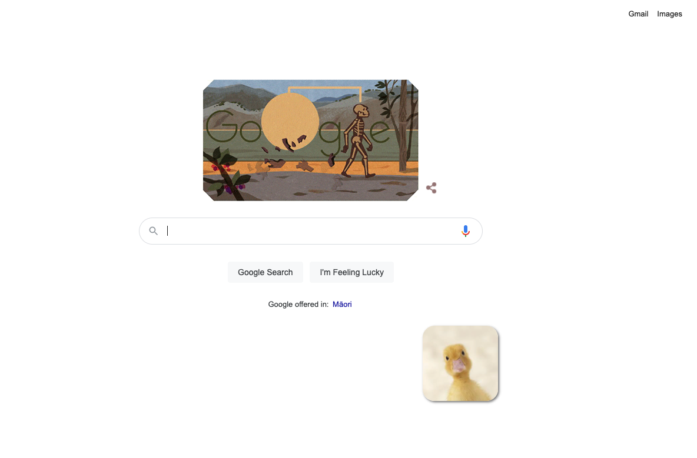

DuckyClick Chrome Extension Example for University of Auckland Web Hackathon

WDCC & SESA Hackathon

- https://sesa.org.nz
- https://www.wdcc.co.nz

### What It Is

- Attach a duck image in the mouse pointer
- Tracks mouse movements whenever the tab/page change

